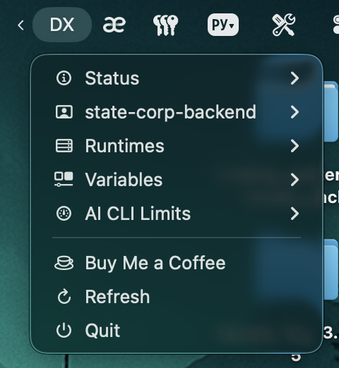
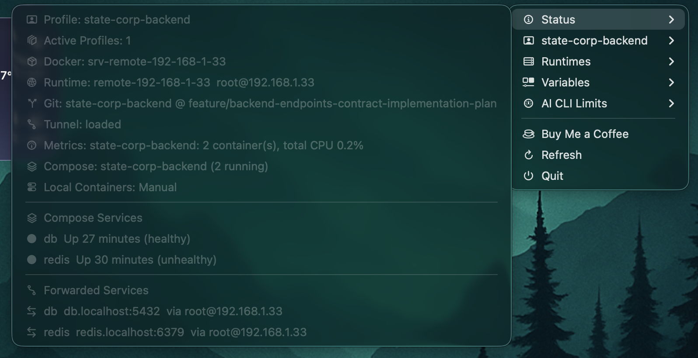
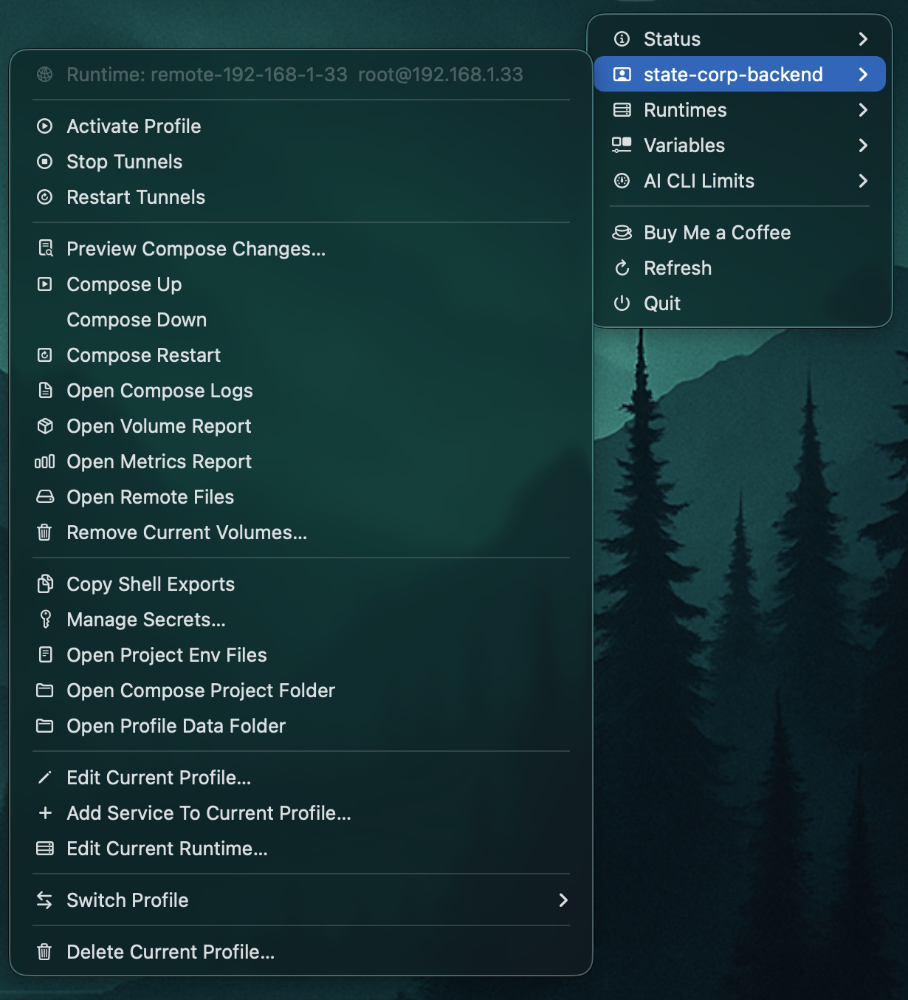
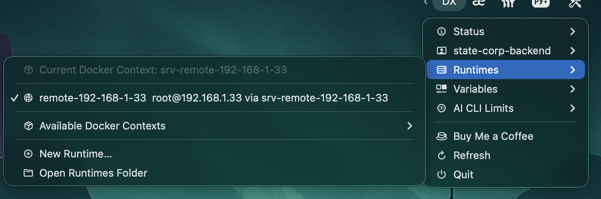
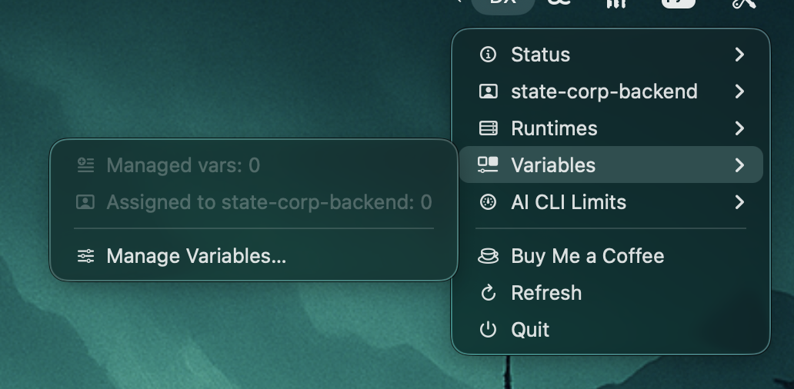

# DevStackMenu Documentation

Welcome to the documentation hub for DevStackMenu.

- [Architecture](ARCHITECTURE.md)
- [ADR Index](adr/0000-index.md)
- [CLI Guardrails](CLI_GUARDRAILS.md)
- [Releasing (repository root)](https://github.com/Mesteriis/dev-stack/blob/main/RELEASING.md)
- [Support (repository root)](https://github.com/Mesteriis/dev-stack/blob/main/SUPPORT.md)
- [Contributing (repository root)](https://github.com/Mesteriis/dev-stack/blob/main/CONTRIBUTING.md)

## Documentation Topics

- Installation and quickstart: `README.md`
- Runtime model and app architecture: [Architecture](ARCHITECTURE.md)
- Architecture decisions and boundary changes: [ADR Index](adr/0000-index.md)
- Release process: [Releasing (repository root)](https://github.com/Mesteriis/dev-stack/blob/main/RELEASING.md)
- Supported workflows and guardrails: [CLI Guardrails](CLI_GUARDRAILS.md)
- Support and issue triage: [Support (repository root)](https://github.com/Mesteriis/dev-stack/blob/main/SUPPORT.md)

## UI Walkthrough

### Main Navigation

The top-level menu is intentionally short: one entry for status, one entry for the current profile, then grouped sections for runtimes and variables.

### Status

The status panel is the operational summary view. It shows the active profile, selected Docker context, runtime target, git branch, tunnel state, compose health, container metrics and forwarded local endpoints.

### Current Profile

The profile submenu is the main workflow surface for an imported project. From here you can activate the profile, control tunnels, run compose lifecycle actions, open logs and reports, inspect synced data, copy exports, manage secrets and jump straight into project files.

### Runtimes

Runtimes are grouped around the current Docker context. The menu highlights the active managed runtime, gives access to the available contexts and keeps runtime creation close to runtime switching.

### Variables

The variables menu stays intentionally compact. It answers two practical questions first: how many managed variables exist, and how many are assigned to the current profile. From there it goes directly into the variable manager.

